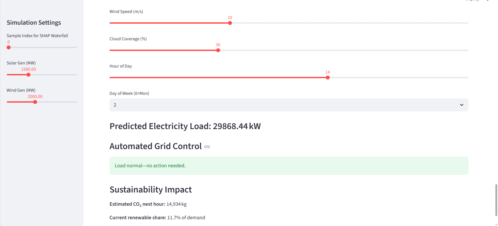
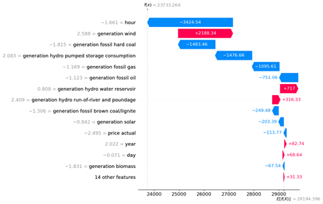
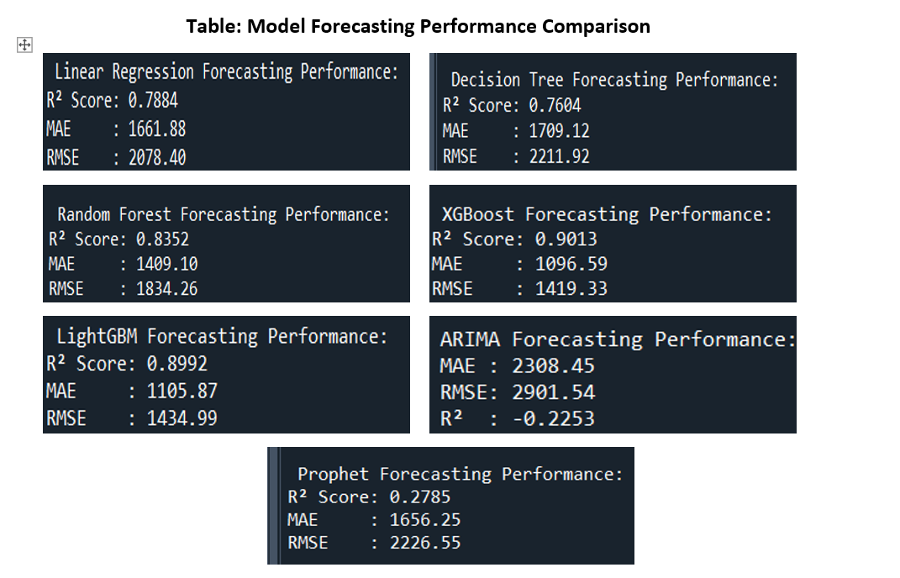

# Electricity Consumption Forecasting for Smart Cities


## Overview

This project presents an end-to-end machine learning solution for forecasting electricity consumption in smart cities.

Using four years of electricity generation, demand, market prices, and weather data from Spain, multiple forecasting approaches were developed and evaluated, including traditional machine learning and time-series forecasting models.

The project includes:

- Data preprocessing and cleaning
- Feature engineering
- Exploratory Data Analysis (EDA)
- Machine learning model training
- Time-series forecasting
- Hyperparameter tuning
- Cross-validation
- Explainable AI using SHAP
- Interactive Streamlit deployment

---

## Project Objectives

- Forecast hourly electricity demand
- Compare multiple forecasting techniques
- Prevent data leakage using TimeSeriesSplit validation
- Understand model predictions through explainability techniques
- Support energy management decisions

---

## Dataset

Dataset obtained from Kaggle:

Energy Consumption, Generation, Prices and Weather

https://www.kaggle.com/datasets/nicholasjhana/energy-consumption-generation-prices-and-weather

### Original Data Sources

- ENTSOE Transparency Platform
- Red Eléctrica de España (REE)
- OpenWeather API

### Dataset Characteristics

#### Energy Dataset

- 35,065 hourly observations
- Electricity demand
- Electricity generation by source
- Market prices
- Generation forecasts
- Load forecasts

#### Weather Dataset

- 178,397 observations
- Five Spanish cities
- Temperature
- Humidity
- Pressure
- Wind speed
- Cloud coverage
- Rain and snow measurements

---

## Exploratory Data Analysis

The project includes several visualization scripts:

- Average load by hour
- Average load by day of week and month
- Load trends over time
- Generation breakdown over time
- Correlation heatmap
- Weather condition frequencies
- Electricity demand distribution by weather conditions

---

## Feature Engineering

Features created include:

- Hour
- Day
- Week
- Month
- Year
- Day of Week
- Weekend Indicator
- Hour Categories
- Weather Categories

Additional preprocessing steps:

- Missing value handling
- One-hot encoding
- Outlier capping using IQR
- StandardScaler normalization

---

## Models Evaluated

### Machine Learning Models

- Linear Regression
- Decision Tree Regressor
- Random Forest Regressor
- XGBoost Regressor
- LightGBM Regressor

### Time-Series Models

- ARIMA
- Prophet

---

## Model Performance

| Model | R² Score |
|---------|---------|
| XGBoost | **0.9013** |
| LightGBM | **0.8990** |
| Random Forest | ~0.87 |
| Linear Regression | ~0.72 |
| ARIMA | ~0.61 |
| Prophet | ~0.58 |

Best performing model:

**XGBoost**
- R² = 0.9013
- MAE = 1096.59

---

## Explainable AI

The project integrates SHAP (SHapley Additive Explanations) to explain model predictions.

Important features identified include:

- Hour of Day
- Wind Generation
- Solar Generation
- Hydro Storage Consumption
- Electricity Price
- Temperature

---

## Dashboard

The project includes a Streamlit application for interactive forecasting.

Features:

- Real-time load prediction
- Scenario simulation
- SHAP explanations
- Energy management alerts
- CSV export functionality

---

## Screenshots

### Dashboard



### SHAP Feature Importance



### Model Comparison



### Load Forecasting Example


---

## Repository Structure

```text
electricity-consumption-forecasting/

├── app/
│   └── str.py
│
├── data/
│   └── DATA.md
│
├── notebooks/
│   ├── EDA_and_Preprocessing.py
│   ├── linear_regression_model.py
│   ├── decision_tree_model.py
│   ├── random_forest_model.py
│   ├── xgboost_model.py
│   ├── light_gbm_model.py
│   ├── arima_model.py
│   ├── prophet_model.py
│   ├── cross_validation.py
│   ├── tuning.py
│   ├── avg_load_by_hour.py
│   ├── avg_load_by_dow_month.py
│   ├── total_load_over_time.py
│   ├── correlationheatmap.py
│   ├── boxplot_load_by_weather.py
│   ├── weather_condition_frequencies.py
│   └── generation_breakdown_over_time.py
│
├── reports/
│
├── requirements.txt
├── .gitignore
└── README.md
```

---

## Installation

Clone the repository:

```bash
git clone https://github.com/sarahassaad140/electricity-consumption-forecasting.git
```

Move into the project folder:

```bash
cd electricity-consumption-forecasting
```

Install dependencies:

```bash
pip install -r requirements.txt
```

---

## Running the Project

Run preprocessing:

```bash
python notebooks/EDA_and_Preprocessing.py
```

Run a model:

```bash
python notebooks/xgboost_model.py
```

Launch the dashboard:

```bash
streamlit run app/str.py
```

---

## Technologies Used

### Programming

- Python

### Data Analysis

- Pandas
- NumPy

### Machine Learning

- Scikit-Learn
- XGBoost
- LightGBM

### Time-Series Forecasting

- ARIMA
- Prophet

### Explainability

- SHAP

### Visualization

- Matplotlib
- Seaborn

### Deployment

- Streamlit

---

## Future Improvements

- LSTM and GRU forecasting models
- Real-time API integration
- Multi-city forecasting
- Smart grid optimization
- Reinforcement learning for energy scheduling

---

## Author

### Sarah Assaad

Final Year Project

Université Saint-Joseph (USJ)

Supervisor: Dr. Nobar Kassabian

2024–2025

---

## License

This project is provided for educational and research purposes.
